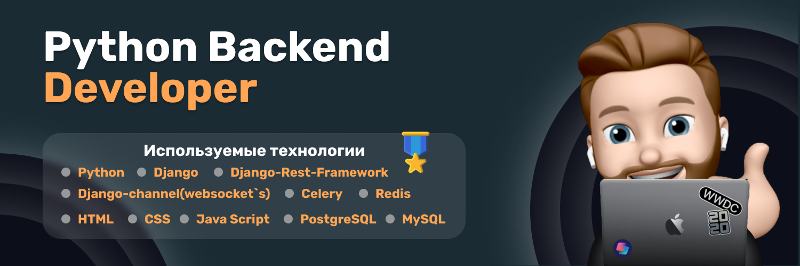

# Full-Stack Python developer

Привет,

Я Максим, Full-Stack Python developer, креативный кодер, специализирующийся на разработке сайтов.

## &#x1f4c8; GitHub Stats

 

<!--  -->

## Профиль codewars

